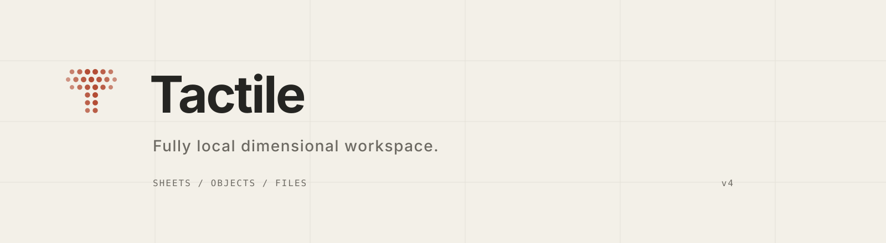

# Tactile



Tactile is a fully local grid for notes, data, and files.

Put objects inside Tiles. Open them directly, then return to the same cell.

Workspaces use common local files: CSV, Markdown, JSON, and native media. They can be viewed and edited outside Tactile.

```bash
npm install
npm run dev
```

Desktop shell:

```bash
npx tauri dev
```

Windows, macOS, and Linux installers are available on the [Releases](https://github.com/aryanxxvii/tactile/releases) page.

[MIT License](LICENSE)
