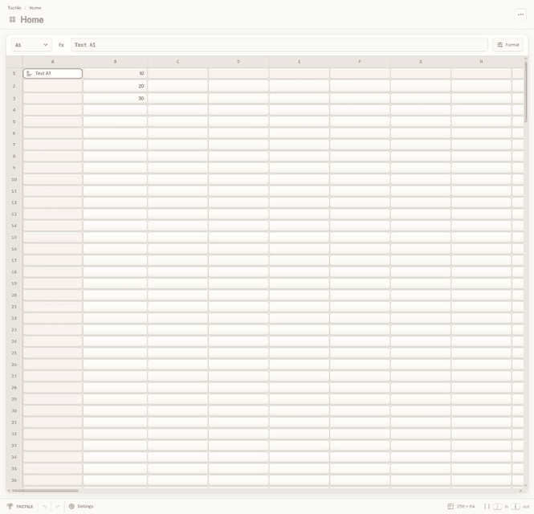
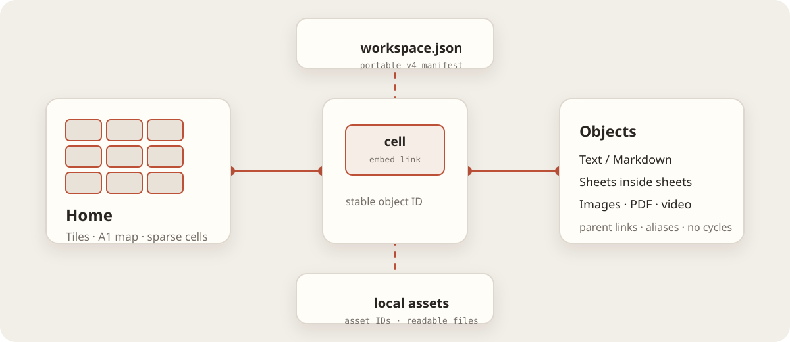

# Tactile


Tactile is a local workspace built on a sheet. Cells hold values or open objects. Objects stay readable on disk.

No account is required. The local copy is the canonical copy.

## Start here

### Browser development

```bash
npm install
npm run dev
```

### Native shell

Rust and the Tauri prerequisites are required for the desktop shell.

```bash
npx tauri dev
```

Packaged builds are published on the [Releases](https://github.com/aryanxxvii/tactile/releases) page. The current public release is [v0.1.4](https://github.com/aryanxxvii/tactile/releases/tag/v0.1.4).

## The product

The sheet is the map.

- **Tiles** are sparse A1 sheets for values, formulas, ranges, formatting, and embedded references.
- **Text** is Markdown stored as a separate object, not inside the cell that opened it.
- **Files** are separate local assets: images, PDFs, videos, HTML, SVG, and other native files.
- **In & Out** preserves the source cell while an embedded child floats or opens full-screen.

Click an embedded cell once to float it. Double-click to open it fully. Use `]` to enter and `[` to return.



## The workspace model

Tactile is a small object graph over a spreadsheet.

```text
workspace
|-- Home sheet
|   |-- ordinary values and formulas
|   |-- embedded Tiles, Text, and Files
|   `-- source-cell links
|-- Markdown objects
|-- native file assets
`-- themes and launch metadata
```

Every object has a stable ID. An embedded link records the object, its parent, its source cell, and its relationship. The same object may be reached through aliases. Cycles are rejected before navigation or export.

The cell syntax is intentionally plain:

```text
[[tactile:<type>:<object-id>|<title>]]
```

Ordinary cells remain sparse. The sheet exports only its used range, while Tactile keeps the visible map at 256 rows by 64 columns. Text and binary data stay in their own records.



## Portable files

The portable v4 workspace is a folder or ZIP bundle with inspectable files.

```text
workspace.json
objects/<object-id>/content.md
objects/<sheet-id>/sheet.csv
assets/<asset-id>/<native-file>
themes/<theme-id>.json
```

The format is documented in [`docs/FILE_FORMAT.md`](docs/FILE_FORMAT.md). Compatibility rules are in [`docs/compatibility/README.md`](docs/compatibility/README.md).

Home and Start are metadata, not containment. Changing the launch object does not re-root the object graph. A saved route can be restored with its complete parent chain.

## Controls

| Action | Input |
| --- | --- |
| Move through a sheet | Arrow keys |
| Edit the active cell | `Enter` or `F2` |
| Enter an embedded object | `]` |
| Return to the parent | `[` |
| Open the Edit menu | `Ctrl ]` |
| Clear selected cells | `Delete` |
| Copy and paste | `Ctrl C` / `Ctrl V` |

## Workspace authoring prompt

Settings includes a versioned **Workspace authoring prompt**. It teaches an LLM the object model, sparse CSV sheets, Markdown objects, asset references, themes, Home/Start metadata, embedded links, and the strict v4 output contract.

For example:

> Make me a workspace to manage my budgets.

The intended result is a human-readable plan, a machine-readable workspace payload, and a validation report.

## Repository map

```text
src/        browser application and workspace model
src-tauri/  native shell and filesystem bridge
docs/       format, architecture, security, QA, and release notes
tests/      unit, compatibility, component, and end-to-end tests
```

Read [`docs/ARCHITECTURE.md`](docs/ARCHITECTURE.md) for the implementation direction and [`AGENTS.md`](AGENTS.md) for durable product constraints.

## Checks

```bash
npm run typecheck
npm run lint
npm run test:unit
npx vite build
```

Native release checks are described in [`docs/release/release-policy.md`](docs/release/release-policy.md). Public artifacts are platform-specific and are accompanied by checksums.

## License

Tactile is released under the [MIT License](LICENSE).

## Status

Tactile is under active development. The storage model is local and portable. The interface is still being refined.
