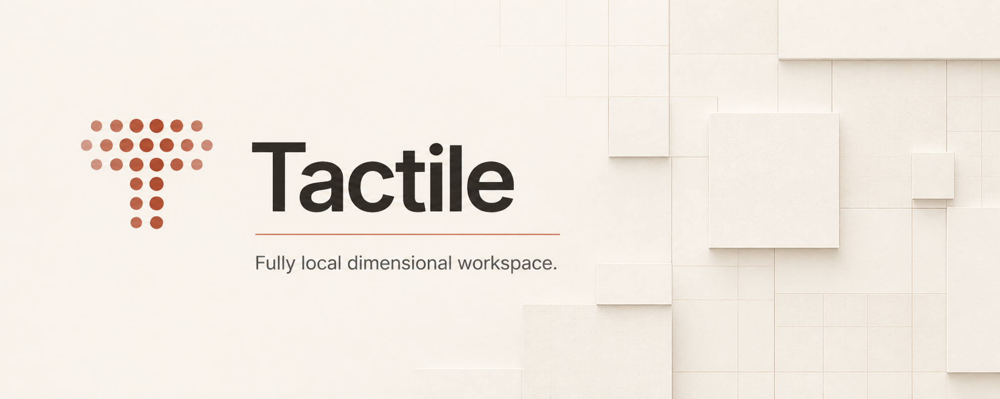
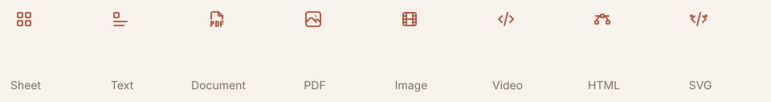

# Tactile



Tactile is a fully local dimensional workspace for sheets, documents, and nested objects. A cell can stay a value, or become a doorway into another object.

The project is intentionally focused. The useful parts are already here: compact A1 sheets, Markdown objects, portable workspace data, and the fast **In & Out** transition between levels.

## Objects

These are the object types available today. The icons below are the same Tabler outline icons used inside the app.



| Type | What it is |
| --- | --- |
| **Sheet** | A compact A1 grid with formulas, ranges, formatting, grouping, filters, resizing, and embedded cells. |
| **Text** | A Markdown-first writing surface with rich inline formatting, color, highlights, lists, tables, images, and preview mode. |
| **Document** | A native Tactile document surface for structured local writing. |
| **PDF** | A local PDF file opened as an embedded object. |
| **Image** | A local image asset opened in its own object view. |
| **Video** | A local video asset with native playback controls. |
| **HTML** | A local HTML file rendered in an isolated object view. |
| **SVG** | A local vector asset rendered at its native scale. |

Any object can contain another object. A document can live inside a sheet, which can live inside another sheet.

## Feature tour

One small tour is enough to get the feel: the sheet, the `In: Tiles` / `In: Text` creation menu, and the staged **In & Out** transition from a cell to a floating object and then full view.


The rest is intentionally left for exploration. Click an embedded cell once to float it, twice to open it fully, press `]` to enter, and `[` to return.

## Run it

```bash
npm install
npm run dev
```

Useful checks:

```bash
npm test
npm run build
```

## Principles

- Local files are canonical. The user owns the workspace.
- Familiar spreadsheet behavior, with room for new object types.
- Dense, quiet UI; speed matters more than ceremony.
- Small working iterations over a grand rewrite.

Tactile is being built as a product, not a dashboard.
